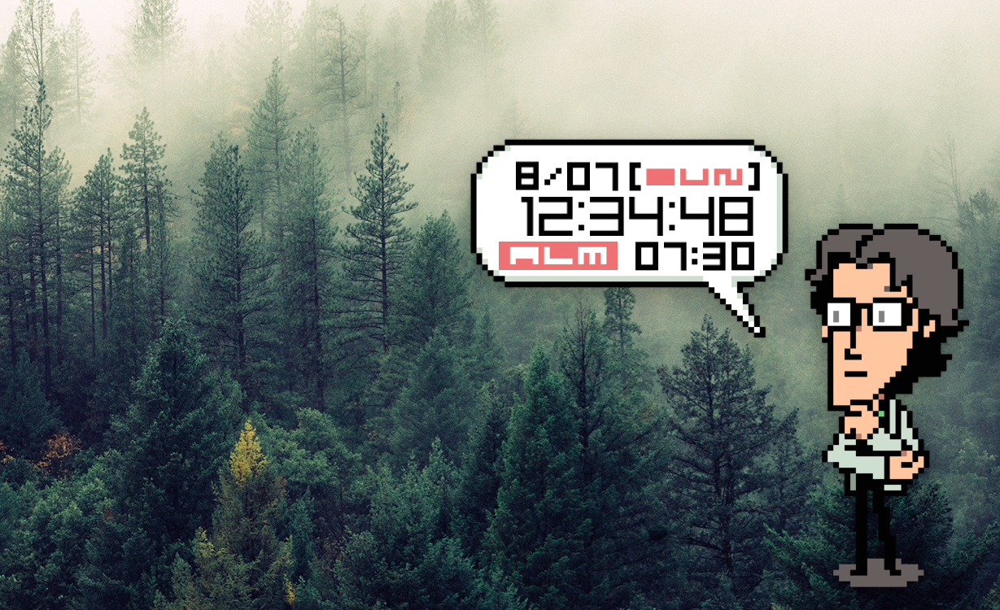

# Otaclock

Otacon is back on your desktop!  This project includes all of the development files as well as a build for OS X.

# How To Install

Otaclock is simple to install, just follow the instructions below for your operating system.

## OS X

Download this repository and navigate to the `Otaclock-darwin-x64` directory.  Drag and drop `Otaclock.app` into your `Applications` folder.  Double click to launch!

# How To Use

Otaclock comes featured with an alarm so you can set it to a time to remeber your important missions.  To activate the alarm just click on the `ALM` button.  When the `ALM` button is red, that means the alarm is active.  To change the time, simply click on the hours or minutes to set them.  To stop the alarm simply click on the `ALM` button again.

# Special Thanks

Special thanks to the following people, for without them this project would not be possible:

* [penguinxr2](https://github.com/penguinxr2) for his audio extraction work
* Darion McCoy